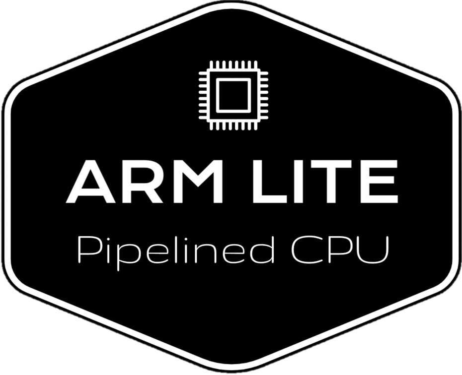
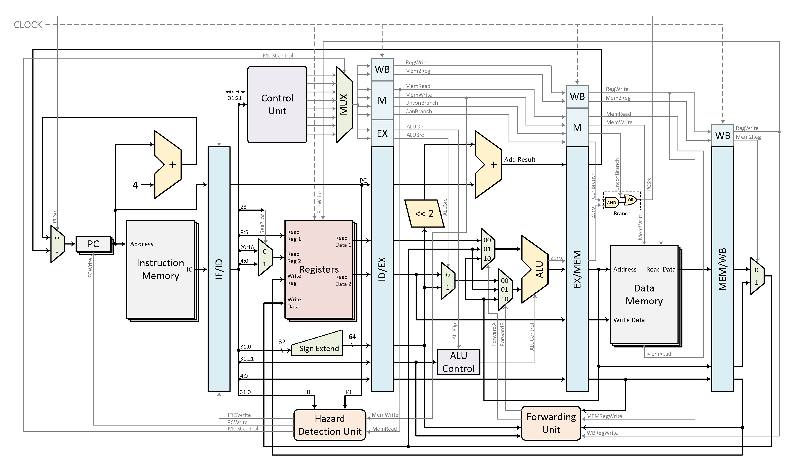

# ARM Lite

This a lite version of ARM CPU that extends ARM LEGv8.
You are encouraged to visit [our website](https://arm-lite.teddy-van-jerry.org).

## CPU Design
### Features
ARM Lite CPU has the following features:
- Subset of standard ARMv8 (64-bit)
- Pipeline
- Hazard Detection and Forwarding
- 18 Instructions

### Supported Instructions
| Instruction Type |       Instructions       |
| :--------------: | ------------------------ |
| R Type           | `ADD`, `SUB`, `AND`, `ORR`, `EOR`, `LSL`, `LSR`, `MUL`
| I Type           | `ADDI`, `SUBI`, `ANDI`, `ORRI`, `EORI`
| D Type           | `LDUR`, `STUR`
| B Type           | `B`
| CB Type          | `CBZ`, `CBNZ`

### Archiecture

> This is drawn by Teddy van Jerry using *Visio Professional 2021*.

## Acknowledgements
- **[ARM-LEGv8](https://github.com/nxbyte/ARM-LEGv8)** by *[nxbyte](https://github.com/nxbyte)*
- **Computer Organization and Design - The Hardware/Software Interface** by *David A. Patterson* and *John L. Hennessy*.

## Simulation Guide
This work is developed on Vivado 2017.4.

## License
This project is licensed under the [MIT LICENSE](LICENSE).
